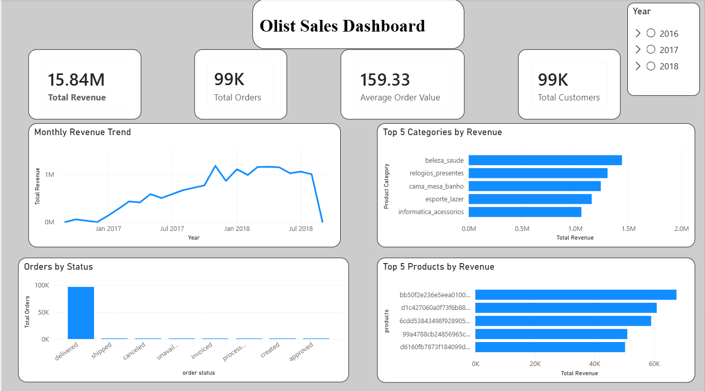
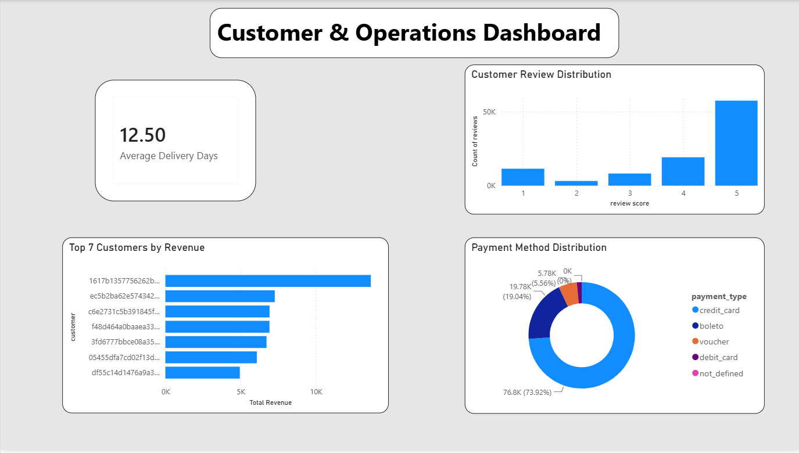

# Olist E-Commerce Analysis

## 📌 Project Overview

An end-to-end Brazilian e-commerce data analysis project using **SQL Server and Power BI**.

The project analyzes sales performance, customers, products, orders, payments, reviews, and delivery performance to identify business trends and actionable insights.

---

## 🎯 Business Objectives

The analysis focuses on answering key business questions:

- How much revenue does the business generate?
- How are sales changing over time?
- Which product categories generate the most revenue?
- Which products generate the highest revenue?
- What is the average order value?
- What is the order-status distribution?
- Which customers contribute the most revenue?
- Which payment methods are most commonly used?
- How are customers rating their purchases?
- What is the average delivery time?

---

## 🛠️ Tools & Technologies

- **SQL Server / SSMS** – Data analysis and querying
- **Power BI** – Dashboard development and visualization
- **Power Query** – Data transformation
- **DAX** – KPI calculations and measures
- **Excel/CSV** – Source data

---

## 📊 Dataset

The project uses the **Brazilian E-Commerce Public Dataset by Olist**.

The dataset contains approximately 100K orders and multiple related tables covering:

- Customers
- Orders
- Order Items
- Products
- Sellers
- Payments
- Reviews
- Geolocation
- Product Category Translation

---

## 📈 Key KPIs

| KPI | Result |
|---|---:|
| Total Revenue | 15.84M |
| Total Orders | 99K |
| Average Order Value | 159.33 |
| Total Customers | 99K |
| Average Delivery Time | 12.50 Days |

---

## 🔍 Key Analysis

### Sales Analysis
- Monthly revenue trends
- Yearly revenue performance
- Top product categories by revenue
- Top products by revenue
- Top customers by spending

### Operations Analysis
- Order status distribution
- Average delivery time
- Payment method distribution

### Customer Analysis
- Customer revenue contribution
- Review score distribution
- Payment preferences

---

## 📊 Power BI Dashboard
### Executive Sales Dashboard



### Customer & Operations Dashboard


### Executive Sales Dashboard

The first dashboard provides an overview of:

- Total Revenue
- Total Orders
- Average Order Value
- Total Customers
- Monthly Revenue Trend
- Top 5 Categories by Revenue
- Orders by Status
- Top 5 Products by Revenue

### Customer & Operations Dashboard

The second dashboard focuses on:

- Average Delivery Time
- Top 10 Customers by Revenue
- Customer Review Distribution
- Payment Method Distribution

---

## 🧮 SQL Analysis

SQL Server was used to perform:

- KPI calculations
- Revenue analysis
- Customer analysis
- Product and category analysis
- Order-status analysis
- Delivery-time analysis
- Review analysis
- CTE-based analysis
- Subqueries
- Window functions such as `RANK()`

SQL queries are organized into:

```text
01_Basic_KPIs.sql
02_Sales_Analysis.sql
03_Advanced_SQL.sql
